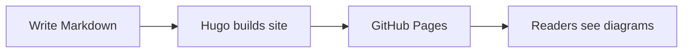
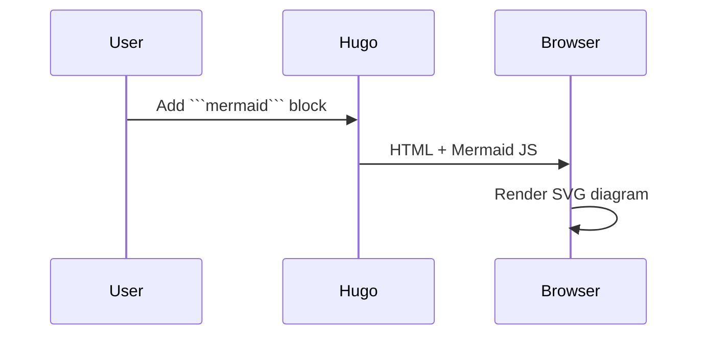
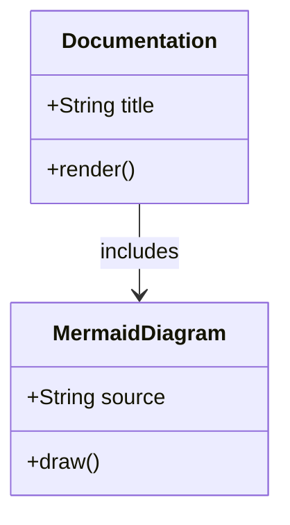
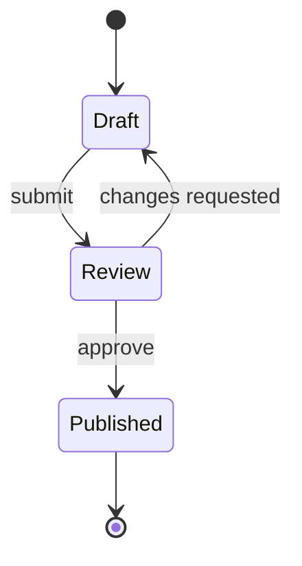
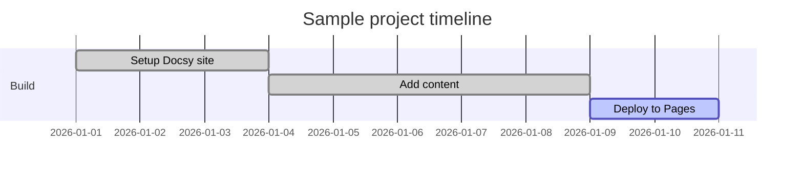
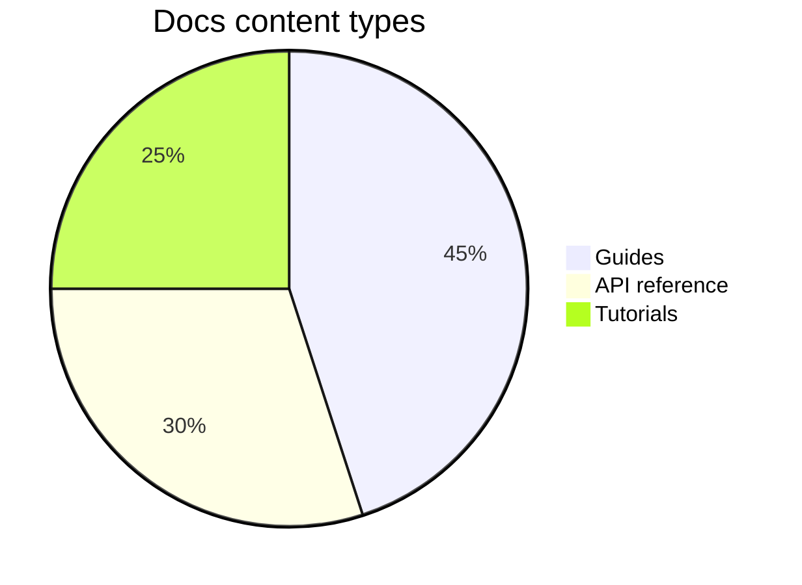

Docsy supports [Mermaid](https://mermaid.js.org/) out of the box. Put diagram code in a fenced code block tagged `mermaid` and it renders automatically in the browser.

## Flowchart

## Sequence diagram

## Class diagram

## State diagram

## Gantt chart

## Pie chart

## Tips

- Mermaid loads only on pages that contain a `mermaid` code block.
- Configure global diagram styling in `hugo.yaml` under `params.mermaid`.
- See the [Docsy diagrams guide](https://www.docsy.dev/docs/content/diagrams-and-formulae/) for PlantUML, KaTeX, and more.
